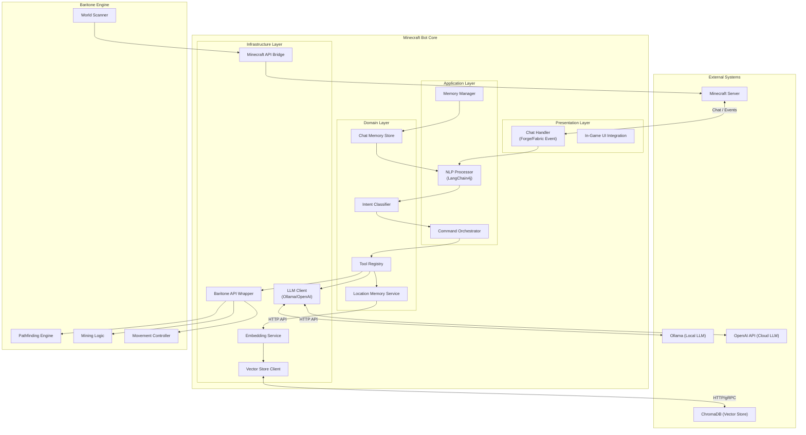
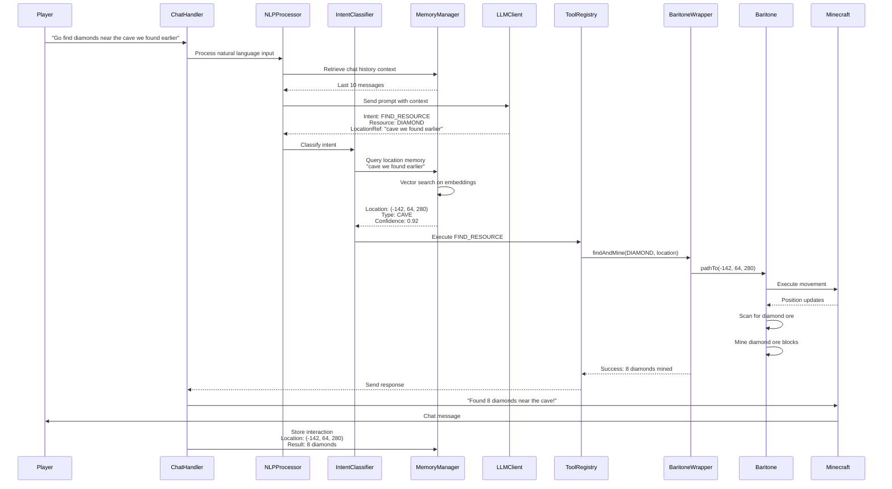
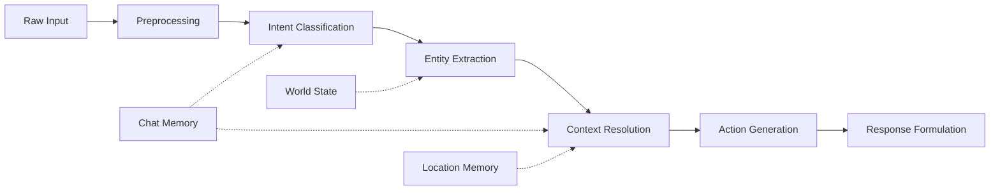
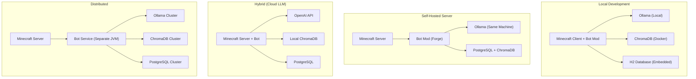

# Minecraft AI Bot Architecture Specification

## LangChain4j + Baritone Integration Platform

**Version:** 1.0  
**Date:** 2026-05-23  
**Status:** Draft - Ready for Sprint Planning  
**Target Audience:** Development Team

---

## 1. Executive Summary

### 1.1 What We're Building

We are architecting an intelligent Minecraft bot that bridges Large Language Model (LLM) capabilities with Minecraft gameplay through a Java-based integration platform. The system combines:

- **LangChain4j** for LLM orchestration, chat memory, and tool calling
- **Baritone** for advanced pathfinding, mining automation, and movement
- **Vector-based memory** for location-aware context and RAG (Retrieval-Augmented Generation)
- **Minecraft integration** via Forge/Fabric mod framework

### 1.2 Why We're Building It

**Problem Statement:**
Traditional Minecraft bots operate on rigid command structures. They cannot understand natural language, maintain conversational context, or adapt to novel situations based on past experiences.

**Solution Value:**
- **Natural Language Interface:** Players interact via chat using conversational English
- **Contextual Awareness:** Bot remembers locations, player preferences, and conversation history
- **Intelligent Automation:** LLM reasoning combined with Baritone's proven pathfinding
- **Extensible Architecture:** Plugin-ready design for custom behaviors and integrations

### 1.3 Success Criteria

| Metric | Target |
|--------|--------|
| Natural language command accuracy | >85% correct interpretation |
| Pathfinding success rate | >95% for known destinations |
| Response latency (local LLM) | <3 seconds |
| Response latency (cloud LLM) | <1.5 seconds |
| Chat memory retention | 20+ message context window |
| Location memory precision | 5-block radius accuracy |

---

## 2. System Architecture Diagram

### 2.1 High-Level Component Overview



### 2.2 Data Flow Sequence



---

## 3. Component Breakdown

### 3.1 LangChain4j Integration Layer

#### 3.1.1 Overview

LangChain4j provides the LLM orchestration framework, enabling:
- **Chat Memory:** Conversational context maintenance
- **Tool Calling:** Function invocation for bot actions
- **RAG Integration:** Location-based memory retrieval
- **Multiple LLM Support:** Ollama (local) and OpenAI (cloud)

#### 3.1.2 Core Components

```java
/**
 * Central LangChain4j configuration and service
 */
@Service
public class LangChain4jService {
    
    private final ChatLanguageModel chatModel;
    private final ChatMemory chatMemory;
    private final ToolRegistry toolRegistry;
    
    public LangChain4jService(
            @Qualifier("primaryChatModel") ChatLanguageModel chatModel,
            ChatMemoryProvider memoryProvider,
            ToolRegistry toolRegistry) {
        this.chatModel = chatModel;
        this.chatMemory = memoryProvider.get("default");
        this.toolRegistry = toolRegistry;
    }
    
    /**
     * Process natural language input and execute appropriate actions
     */
    public BotResponse processInput(String playerMessage, String playerId) {
        // Build AI service with tools
        Assistant assistant = AiServices.builder(Assistant.class)
            .chatLanguageModel(chatModel)
            .chatMemory(chatMemory)
            .tools(toolRegistry.getTools())
            .build();
        
        return assistant.chat(playerMessage);
    }
    
    /**
     * Interface defining available tools for the LLM
     */
    public interface Assistant {
        @SystemMessage("""
            You are a helpful Minecraft bot assistant. You can:
            - Navigate to locations
            - Mine resources
            - Build structures
            - Remember places
            - Answer questions about the world
            
            Always confirm actions before executing dangerous operations.
            """)
        BotResponse chat(String message);
    }
}
```

#### 3.1.3 Chat Memory Configuration

```java
@Configuration
public class ChatMemoryConfig {
    
    @Bean
    public ChatMemoryProvider chatMemoryProvider() {
        return memoryId -> MessageWindowChatMemory.builder()
            .id(memoryId)
            .maxMessages(20)  // Retain last 20 messages
            .build();
    }
    
    /**
     * Persistent chat memory for location-based context
     */
    @Bean
    @Qualifier("persistentChatMemory")
    public ChatMemory persistentChatMemory(RedisChatMemoryStore store) {
        return PersistentChatMemory.builder()
            .chatMemoryStore(store)
            .maxMessages(100)
            .build();
    }
}
```

#### 3.1.4 Tool Definition Example

```java
/**
 * Tools available to the LLM for Minecraft interactions
 */
@Component
public class MinecraftTools {
    
    private final BaritoneService baritone;
    private final LocationMemoryService locationMemory;
    
    @Tool("Navigate to specified coordinates or named location")
    public String navigateTo(
            @P("X coordinate, named location, or player name") String destination,
            @P("Optional: Y coordinate") Integer y,
            @P("Optional: Z coordinate") Integer z) {
        
        // Resolve destination
        TargetLocation target = resolveDestination(destination, y, z);
        
        // Execute via Baritone
        PathResult result = baritone.pathTo(target);
        
        return result.isSuccess() 
            ? "Navigating to " + target 
            : "Cannot navigate: " + result.getError();
    }
    
    @Tool("Mine specific ore or block type")
    public String mineResource(
            @P("Block type to mine: DIAMOND_ORE, IRON_ORE, COAL_ORE, etc.") String blockType,
            @P("Maximum blocks to mine") int maxBlocks,
            @P("Optional: Search radius in blocks") Integer radius) {
        
        Block targetBlock = Block.valueOf(blockType);
        int searchRadius = radius != null ? radius : 64;
        
        MiningResult result = baritone.mine(targetBlock, maxBlocks, searchRadius);
        
        return String.format("Mined %d %s blocks", result.getBlocksMined(), blockType);
    }
    
    @Tool("Remember a location with a name and optional tags")
    public String rememberLocation(
            @P("Name for this location") String name,
            @P("Optional: Description or tags") String description) {
        
        Location currentLoc = baritone.getPlayerPosition();
        LocationMemoryEntry entry = LocationMemoryEntry.builder()
            .name(name)
            .description(description)
            .coordinates(currentLoc)
            .timestamp(Instant.now())
            .build();
        
        locationMemory.store(entry);
        return "Remembered location '" + name + "' at " + currentLoc;
    }
    
    @Tool("Find a previously remembered location by name or description")
    public String findLocation(
            @P("Name or description of location to find") String query) {
        
        List<LocationMemoryEntry> matches = locationMemory.search(query, 3);
        
        if (matches.isEmpty()) {
            return "No locations found matching '" + query + "'";
        }
        
        return matches.stream()
            .map(m -> String.format("%s: %s (%.0f blocks away)",
                m.getName(), m.getCoordinates(), m.distanceTo(baritone.getPlayerPosition())))
            .collect(Collectors.joining("\n"));
    }
}
```

### 3.2 Baritone API Wrapper

#### 3.2.1 Overview

Baritone is the de facto standard for Minecraft pathfinding and automation. Our wrapper provides:
- **Type-safe API:** Java interfaces over Baritone's internal methods
- **Event Translation:** Baritone events → Bot events
- **Safety Controls:** Confirmation for destructive operations
- **Progress Tracking:** Real-time feedback on long-running operations

#### 3.2.2 Architecture

```java
/**
 * Service layer wrapping Baritone API
 */
@Service
public class BaritoneService {
    
    private final IBaritone baritone;
    private final EventBus eventBus;
    private final ExecutorService executor;
    
    public BaritoneService(Minecraft minecraft, EventBus eventBus) {
        this.baritone = BaritoneAPI.getProvider().getPrimaryBaritone();
        this.eventBus = eventBus;
        this.executor = Executors.newSingleThreadExecutor();
    }
    
    /**
     * Navigate to target coordinates using Baritone pathfinding
     */
    public PathResult pathTo(TargetLocation target) {
        Goal goal = createGoal(target);
        
        // Subscribe to pathing events
        PathListener listener = new PathListener();
        baritone.getGameEventHandler().registerEventListener(listener);
        
        try {
            // Execute pathing
            PathingCommand command = new PathingCommand(goal, PathingCommandType.REQUEST_PAUSE);
            baritone.getPathingControlManager().execute(command);
            
            // Wait for completion or timeout
            return listener.awaitResult(300, TimeUnit.SECONDS);
            
        } finally {
            baritone.getGameEventHandler().unregisterEventListener(listener);
        }
    }
    
    /**
     * Mine specified block type within radius
     */
    public MiningResult mine(Block blockType, int maxBlocks, int radius) {
        // Create mining filter
        Predicate<BlockPos> filter = pos -> 
            Minecraft.getInstance().level.getBlockState(pos).getBlock() == blockType;
        
        // Configure Baritone mine process
        MineProcess mineProcess = baritone.getMineProcess();
        mineProcess.mine(maxBlocks, filter, new BlockPosFilter(radius));
        
        // Track progress
        MiningTracker tracker = new MiningTracker(maxBlocks);
        baritone.getGameEventHandler().registerEventListener(tracker);
        
        return tracker.awaitCompletion();
    }
    
    /**
     * Follow a player entity
     */
    public FollowResult followPlayer(String playerName, double distance) {
        Player target = findPlayer(playerName);
        if (target == null) {
            return FollowResult.playerNotFound(playerName);
        }
        
        FollowProcess followProcess = baritone.getFollowProcess();
        followProcess.follow(entity -> entity.getName().getString().equals(playerName));
        
        return FollowResult.started(playerName);
    }
    
    /**
     * Get current player position
     */
    public Location getPlayerPosition() {
        BetterBlockPos pos = baritone.getPlayerContext().playerFeet();
        return new Location(pos.x, pos.y, pos.z);
    }
    
    /**
     * Cancel current operation
     */
    public void cancel() {
        baritone.getPathingBehavior().cancelEverything();
    }
    
    private Goal createGoal(TargetLocation target) {
        if (target.isCoordinate()) {
            return new GoalBlock(target.getX(), target.getY(), target.getZ());
        } else if (target.isEntity()) {
            return new GoalNear(target.getEntity(), 2);
        } else {
            throw new IllegalArgumentException("Unknown target type");
        }
    }
}
```

#### 3.2.3 Baritone Process Types

| Process | Purpose | Use Case |
|---------|---------|----------|
| `MineProcess` | Automated mining | Resource gathering, strip mining |
| `BuilderProcess` | Structure building | Building templates, scaffolding |
| `FarmProcess` | Automated farming | Crop harvesting, replanting |
| `FollowProcess` | Entity following | Following players, mobs |
| `CustomGoalProcess` | Generic pathing | Navigation to coordinates |
| `ExploreProcess` | Area exploration | Mapping unknown terrain |

### 3.3 Vector Store for Location-Based Memory

#### 3.3.1 Overview

Location memory enables the bot to:
- **Remember places** by natural language descriptions
- **Search semantically** ("that cave with diamonds" → matching locations)
- **Contextualize** current position relative to remembered locations
- **Learn** from player interactions about place significance

#### 3.3.2 Architecture

```java
/**
 * Service for location memory with vector embeddings
 */
@Service
public class LocationMemoryService {
    
    private final EmbeddingStore<TextSegment> embeddingStore;
    private final EmbeddingModel embeddingModel;
    private final LocationRepository locationRepository;
    
    public LocationMemoryService(
            @Qualifier("chromaEmbeddingStore") EmbeddingStore<TextSegment> store,
            EmbeddingModel embeddingModel,
            LocationRepository repository) {
        this.embeddingStore = store;
        this.embeddingModel = embeddingModel;
        this.locationRepository = repository;
    }
    
    /**
     * Store a location with semantic embedding
     */
    public void store(LocationMemoryEntry entry) {
        // Create rich description for embedding
        String description = buildDescription(entry);
        
        // Generate embedding
        Embedding embedding = embeddingModel.embed(description).content();
        
        // Store in vector database
        TextSegment segment = TextSegment.from(description, Metadata.from(
            "location_id", entry.getId(),
            "coordinates", entry.getCoordinates().toString(),
            "name", entry.getName()
        ));
        
        embeddingStore.add(embedding, segment);
        
        // Persist to relational store
        locationRepository.save(entry);
    }
    
    /**
     * Semantic search for locations
     */
    public List<LocationMemoryEntry> search(String query, int maxResults) {
        // Embed query
        Embedding queryEmbedding = embeddingModel.embed(query).content();
        
        // Search vector store
        List<EmbeddingMatch<TextSegment>> matches = embeddingStore
            .findRelevant(queryEmbedding, maxResults, 0.7);
        
        // Retrieve full entries
        return matches.stream()
            .map(match -> {
                String locationId = match.embedded().metadata().getString("location_id");
                return locationRepository.findById(UUID.fromString(locationId))
                    .orElse(null);
            })
            .filter(Objects::nonNull)
            .collect(Collectors.toList());
    }
    
    /**
     * Find locations near current position
     */
    public List<LocationMemoryEntry> findNearby(Location currentPos, int radius) {
        return locationRepository.findWithinRadius(
            currentPos.getX(), currentPos.getY(), currentPos.getZ(), radius
        );
    }
    
    private String buildDescription(LocationMemoryEntry entry) {
        return String.format(
            "Location: %s. Description: %s. Coordinates: %s. Type: %s. " +
            "Biome: %s. Notable features: %s",
            entry.getName(),
            entry.getDescription(),
            entry.getCoordinates(),
            entry.getLocationType(),
            entry.getBiome(),
            entry.getNotableFeatures()
        );
    }
}
```

#### 3.3.3 Data Model

```java
@Entity
@Table(name = "location_memory")
public class LocationMemoryEntry {
    
    @Id
    private UUID id;
    
    @Column(nullable = false)
    private String name;
    
    @Column(length = 1000)
    private String description;
    
    @Embedded
    private Location coordinates;
    
    @Enumerated(EnumType.STRING)
    private LocationType locationType;
    
    private String biome;
    private String notableFeatures;
    private Instant timestamp;
    private String discoveredBy;  // Player who discovered/mentioned
    
    @ElementCollection
    @CollectionTable(name = "location_tags")
    private Set<String> tags;
    
    // Utility methods
    public double distanceTo(Location other) {
        return coordinates.distanceTo(other);
    }
}

@Embeddable
public class Location {
    private int x;
    private int y;
    private int z;
    
    public double distanceTo(Location other) {
        return Math.sqrt(
            Math.pow(x - other.x, 2) +
            Math.pow(y - other.y, 2) +
            Math.pow(z - other.z, 2)
        );
    }
    
    @Override
    public String toString() {
        return String.format("(%d, %d, %d)", x, y, z);
    }
}

public enum LocationType {
    CAVE,
    MINESHAFT,
    VILLAGE,
    STRONGHOLD,
    NETHER_FORTRESS,
    BASE,
    FARM,
    LANDMARK,
    RESOURCE_SITE,
    DANGER_ZONE
}
```

#### 3.3.4 ChromaDB Configuration

```java
@Configuration
@Profile("chroma")
public class ChromaConfiguration {
    
    @Value("${chroma.host:localhost}")
    private String chromaHost;
    
    @Value("${chroma.port:8000}")
    private int chromaPort;
    
    @Value("${chroma.collection:mc_locations}")
    private String collectionName;
    
    @Bean
    public ChromaClient chromaClient() {
        return new ChromaClient.Builder()
            .baseUrl("http://" + chromaHost + ":" + chromaPort)
            .build();
    }
    
    @Bean
    public ChromaEmbeddingStore chromaEmbeddingStore(ChromaClient client) {
        return ChromaEmbeddingStore.builder()
            .baseUrl("http://" + chromaHost + ":" + chromaPort)
            .collectionName(collectionName)
            .build();
    }
}
```

#### 3.3.5 In-Memory Alternative (Development)

```java
@Configuration
@Profile("dev")
public class InMemoryVectorStoreConfig {
    
    @Bean
    public EmbeddingStore<TextSegment> inMemoryEmbeddingStore() {
        return new InMemoryEmbeddingStore<>();
    }
}
```

### 3.4 Minecraft Connection Layer

#### 3.4.1 Overview

The connection layer bridges our bot logic with Minecraft. Two primary approaches:

| Approach | Framework | Use Case | Pros | Cons |
|----------|-----------|----------|------|------|
| **Mod Integration** | Forge/Fabric | Single-player, self-hosted servers | Full game access, no external dependencies | Requires mod installation |
| **Protocol Library** | Mineflayer | External bot, multiplayer servers | No client mod needed, standalone | Limited to protocol features |

**Decision:** Forge/Fabric mod for self-hosted servers (primary), with Mineflayer adapter for external servers (future).

#### 3.4.2 Forge/Fabric Integration

```java
/**
 * Main mod entry point for Forge
 */
@Mod("mc_aibot")
public class MinecraftAIBotMod {
    
    private static final Logger LOGGER = LogManager.getLogger();
    private final BotApplicationContext botContext;
    
    public MinecraftAIBotMod() {
        // Initialize Spring context
        this.botContext = new BotApplicationContext();
        
        // Register Forge events
        MinecraftForge.EVENT_BUS.register(this);
        
        // Register client tick handler
        FMLJavaModLoadingContext.get().getModEventBus()
            .addListener(this::onClientSetup);
    }
    
    private void onClientSetup(FMLClientSetupEvent event) {
        // Initialize Baritone
        BaritoneAPI.getProvider();
        
        // Start bot services
        botContext.initialize();
    }
    
    @SubscribeEvent
    public void onChatReceived(ClientChatReceivedEvent event) {
        String message = event.getMessage().getString();
        
        // Check if message is directed at bot
        if (isBotMention(message)) {
            String playerName = extractPlayerName(event);
            String command = extractCommand(message);
            
            // Process asynchronously
            botContext.getChatHandler().processCommand(playerName, command);
        }
    }
    
    @SubscribeEvent
    public void onClientTick(TickEvent.ClientTickEvent event) {
        if (event.phase == TickEvent.Phase.END) {
            // Update bot state machine
            botContext.getStateManager().tick();
        }
    }
    
    @SubscribeEvent
    public void onWorldLoad(WorldEvent.Load event) {
        botContext.getLocationService().onWorldChange(
            event.getWorld().dimension().location().toString()
        );
    }
}
```

#### 3.4.3 Chat Handler

```java
/**
 * Handles incoming chat messages and bot responses
 */
@Component
public class ChatHandler {
    
    private final LangChain4jService langChainService;
    private final BaritoneService baritone;
    private final ExecutorService executor;
    
    public void processCommand(String playerName, String command) {
        executor.submit(() -> {
            try {
                // Process through LLM
                BotResponse response = langChainService.processInput(
                    command, 
                    playerName
                );
                
                // Send response to chat
                sendChatMessage(response.getMessage());
                
                // Execute any actions
                if (response.hasActions()) {
                    executeActions(response.getActions());
                }
                
            } catch (Exception e) {
                LOGGER.error("Error processing command", e);
                sendChatMessage("Sorry, I encountered an error: " + e.getMessage());
            }
        });
    }
    
    private void sendChatMessage(String message) {
        Minecraft minecraft = Minecraft.getInstance();
        if (minecraft.player != null) {
            minecraft.player.chat(message);
        }
    }
}
```

---

## 4. Data Flow Architecture

### 4.1 Natural Language Processing Pipeline



### 4.2 Processing Stages

| Stage | Component | Description |
|-------|-----------|-------------|
| **Preprocessing** | `InputPreprocessor` | Normalize text, handle mentions, extract player context |
| **Intent Classification** | `IntentClassifier` | LLM-based intent detection (NAVIGATE, MINE, BUILD, QUERY) |
| **Entity Extraction** | `EntityExtractor` | Extract coordinates, block types, player names, locations |
| **Context Resolution** | `ContextResolver` | Resolve "the cave" → specific coordinates via vector search |
| **Action Generation** | `ActionPlanner` | Map intent + entities → Baritone commands |
| **Response Formulation** | `ResponseGenerator` | Generate natural language confirmation/result |

### 4.3 Example Data Flow

**Input:** *"Go back to that village near spawn where we found the blacksmith"*

```
1. PREPROCESSING
   Input: "Go back to that village near spawn where we found the blacksmith"
   Normalized: "navigate to village near spawn with blacksmith"
   
2. INTENT CLASSIFICATION
   Intent: NAVIGATE
   Confidence: 0.97
   
3. ENTITY EXTRACTION
   Location: "village near spawn with blacksmith"
   Reference: "that" (anaphora - requires context)
   
4. CONTEXT RESOLUTION
   Query embedding: "village near spawn blacksmith"
   Vector search results:
     - "Village with blacksmith at spawn" (0.94 similarity)
     - "Desert village far north" (0.67 similarity)
   Selected: Village at (120, 64, -340)
   
5. ACTION GENERATION
   Action: PathTo(coordinates=(120, 64, -340))
   Tool: BaritoneWrapper.navigateTo()
   
6. RESPONSE FORMULATION
   Response: "Heading to the village with the blacksmith at (120, 64, -340). 
              That's about 450 blocks away, should take 2-3 minutes."
```

---

## 5. API Contracts

### 5.1 Interface Definitions

#### 5.1.1 Bot Core API

```java
/**
 * Primary interface for bot operations
 */
public interface BotService {
    
    /**
     * Process a natural language command
     * @param playerId Player sending the command
     * @param message Natural language input
     * @return Bot response with optional actions
     */
    BotResponse processCommand(String playerId, String message);
    
    /**
     * Execute a specific action
     * @param action Action to execute
     * @return Result of execution
     */
    ActionResult executeAction(BotAction action);
    
    /**
     * Get current bot status
     */
    BotStatus getStatus();
    
    /**
     * Cancel current operation
     */
    void cancelCurrentOperation();
}

public class BotResponse {
    private final String message;
    private final List<BotAction> actions;
    private final boolean requiresConfirmation;
    private final Confidence confidence;
    
    // Builder pattern
    public static Builder builder() { return new Builder(); }
}

public enum Confidence {
    HIGH,    // >0.9 - Execute immediately
    MEDIUM,  // 0.7-0.9 - Execute with confirmation
    LOW      // <0.7 - Ask for clarification
}
```

#### 5.1.2 Baritone Wrapper API

```java
/**
 * Baritone integration interface
 */
public interface BaritoneOperations {
    
    // Navigation
    PathResult navigateTo(Coordinates coordinates);
    PathResult navigateTo(String locationName);
    PathResult followPlayer(String playerName);
    PathResult exploreArea(int radius);
    
    // Mining
    MiningResult mine(BlockType blockType, int maxBlocks);
    MiningResult mine(BlockType blockType, int maxBlocks, int radius);
    MiningResult stripMine(int length, int width);
    
    // Building
    BuildResult build(String schematicName, Coordinates position);
    BuildResult placeBlock(BlockType block, Coordinates position);
    
    // Information
    Coordinates getCurrentPosition();
    WorldScanResult scanArea(int radius);
    List<Entity> getNearbyEntities(int radius);
    
    // Control
    void cancel();
    void pause();
    void resume();
}

public class PathResult {
    private final boolean success;
    private final String message;
    private final int blocksTraveled;
    private final Duration duration;
    private final PathResultType type;
    
    public enum PathResultType {
        SUCCESS,
        BLOCKED,
        TIMEOUT,
        CANCELLED,
        ERROR
    }
}
```

#### 5.1.3 Location Memory API

```java
/**
 * Location memory operations
 */
public interface LocationMemoryOperations {
    
    /**
     * Store a new location
     */
    void store(LocationEntry entry);
    
    /**
     * Semantic search for locations
     */
    List<LocationEntry> search(String query, int maxResults);
    
    /**
     * Search with minimum similarity threshold
     */
    List<LocationEntry> search(String query, int maxResults, double minSimilarity);
    
    /**
     * Find locations near coordinates
     */
    List<LocationEntry> findNearby(Coordinates center, int radius);
    
    /**
     * Get location by exact name
     */
    Optional<LocationEntry> getByName(String name);
    
    /**
     * Update location metadata
     */
    void update(UUID locationId, LocationUpdate update);
    
    /**
     * Delete location
     */
    void delete(UUID locationId);
}

public class LocationEntry {
    private final UUID id;
    private final String name;
    private final String description;
    private final Coordinates coordinates;
    private final LocationType type;
    private final Set<String> tags;
    private final Instant createdAt;
    private final String createdBy;
    private final Map<String, Object> metadata;
}
```

#### 5.1.4 LLM Provider API

```java
/**
 * Abstraction over LLM providers
 */
public interface LLMProvider {
    
    /**
     * Send chat completion request
     */
    ChatResponse chat(ChatRequest request);
    
    /**
     * Generate embeddings
     */
    List<Double> embed(String text);
    
    /**
     * Check provider availability
     */
    boolean isAvailable();
    
    /**
     * Get provider name
     */
    String getName();
}

public class ChatRequest {
    private final String systemPrompt;
    private final List<Message> messages;
    private final List<ToolDefinition> tools;
    private final double temperature;
    private final int maxTokens;
    
    // Builder
}

public class ChatResponse {
    private final String content;
    private final List<ToolCall> toolCalls;
    private final TokenUsage tokenUsage;
    private final Duration latency;
}
```

### 5.2 Event System

```java
/**
 * Event bus for decoupled component communication
 */
public interface BotEventBus {
    
    void publish(BotEvent event);
    void subscribe(Class<? extends BotEvent> eventType, EventHandler handler);
    void unsubscribe(EventHandler handler);
}

// Event types
public class CommandReceivedEvent extends BotEvent {
    private final String playerId;
    private final String command;
    private final Instant timestamp;
}

public class ActionStartedEvent extends BotEvent {
    private final String actionId;
    private final BotAction action;
    private final Instant startedAt;
}

public class ActionCompletedEvent extends BotEvent {
    private final String actionId;
    private final ActionResult result;
    private final Instant completedAt;
}

public class LocationDiscoveredEvent extends BotEvent {
    private final LocationEntry location;
    private final String discoveredBy;
}

public class PathingProgressEvent extends BotEvent {
    private final String pathId;
    private final Coordinates current;
    private final Coordinates target;
    private final int blocksRemaining;
    private final double percentComplete;
}
```

---

## 6. Technology Stack

### 6.1 Core Dependencies

```xml
<!-- pom.xml -->
<properties>
    <java.version>17</java.version>
    <minecraft.version>1.20.1</minecraft.version>
    <forge.version>47.1.0</forge.version>
    <baritone.version>1.10.1</baritone.version>
    <langchain4j.version>0.31.0</langchain4j.version>
    <spring-boot.version>3.2.0</spring-boot.version>
</properties>

<dependencies>
    <!-- Minecraft / Forge -->
    <dependency>
        <groupId>net.minecraftforge</groupId>
        <artifactId>forge</artifactId>
        <version>${minecraft.version}-${forge.version}</version>
        <scope>provided</scope>
    </dependency>
    
    <!-- Baritone -->
    <dependency>
        <groupId>baritone</groupId>
        <artifactId>baritone-api</artifactId>
        <version>${baritone.version}</version>
    </dependency>
    
    <!-- LangChain4j -->
    <dependency>
        <groupId>dev.langchain4j</groupId>
        <artifactId>langchain4j</artifactId>
        <version>${langchain4j.version}</version>
    </dependency>
    <dependency>
        <groupId>dev.langchain4j</groupId>
        <artifactId>langchain4j-ollama</artifactId>
        <version>${langchain4j.version}</version>
    </dependency>
    <dependency>
        <groupId>dev.langchain4j</groupId>
        <artifactId>langchain4j-open-ai</artifactId>
        <version>${langchain4j.version}</version>
    </dependency>
    <dependency>
        <groupId>dev.langchain4j</groupId>
        <artifactId>langchain4j-chroma</artifactId>
        <version>${langchain4j.version}</version>
    </dependency>
    
    <!-- Spring Boot (for DI and configuration) -->
    <dependency>
        <groupId>org.springframework.boot</groupId>
        <artifactId>spring-boot-starter</artifactId>
        <version>${spring-boot.version}</version>
    </dependency>
    
    <!-- Database -->
    <dependency>
        <groupId>org.springframework.boot</groupId>
        <artifactId>spring-boot-starter-data-jpa</artifactId>
        <version>${spring-boot.version}</version>
    </dependency>
    <dependency>
        <groupId>com.h2database</groupId>
        <artifactId>h2</artifactId>
        <scope>runtime</scope>
    </dependency>
    <dependency>
        <groupId>org.postgresql</groupId>
        <artifactId>postgresql</artifactId>
        <scope>runtime</scope>
    </dependency>
    
    <!-- HTTP Client -->
    <dependency>
        <groupId>org.apache.httpcomponents.client5</groupId>
        <artifactId>httpclient5</artifactId>
        <version>5.2.1</version>
    </dependency>
    
    <!-- Utilities -->
    <dependency>
        <groupId>org.projectlombok</groupId>
        <artifactId>lombok</artifactId>
        <version>1.18.30</version>
        <scope>provided</scope>
    </dependency>
    <dependency>
        <groupId>com.google.guava</groupId>
        <artifactId>guava</artifactId>
        <version>32.1.3-jre</version>
    </dependency>
    
    <!-- Testing -->
    <dependency>
        <groupId>org.springframework.boot</groupId>
        <artifactId>spring-boot-starter-test</artifactId>
        <scope>test</scope>
    </dependency>
</dependencies>
```

### 6.2 Gradle Alternative

```groovy
// build.gradle
plugins {
    id 'java'
    id 'net.minecraftforge.gradle' version '[6.0,6.2)'
}

java {
    toolchain.languageVersion = JavaLanguageVersion.of(17)
}

minecraft {
    mappings channel: 'official', version: '1.20.1'
    runs {
        client {
            workingDirectory project.file('run')
            mods { mc_aibot { source sourceSets.main } }
        }
    }
}

dependencies {
    minecraft 'net.minecraftforge:forge:1.20.1-47.1.0'
    
    implementation 'baritone:baritone-api:1.10.1'
    
    implementation platform('dev.langchain4j:langchain4j-bom:0.31.0')
    implementation 'dev.langchain4j:langchain4j'
    implementation 'dev.langchain4j:langchain4j-ollama'
    implementation 'dev.langchain4j:langchain4j-open-ai'
    implementation 'dev.langchain4j:langchain4j-chroma'
    
    implementation platform('org.springframework.boot:spring-boot-dependencies:3.2.0')
    implementation 'org.springframework.boot:spring-boot-starter'
    implementation 'org.springframework.boot:spring-boot-starter-data-jpa'
    
    runtimeOnly 'com.h2database:h2'
    runtimeOnly 'org.postgresql:postgresql'
    
    compileOnly 'org.projectlombok:lombok:1.18.30'
    annotationProcessor 'org.projectlombok:lombok:1.18.30'
}
```

### 6.3 Version Compatibility Matrix

| Component | Version | Java | Notes |
|-----------|---------|------|-------|
| Minecraft | 1.20.1 | 17 | LTS version with broad mod support |
| Forge | 47.1.0 | 17 | Stable for 1.20.1 |
| Fabric | 0.14.22 | 17 | Alternative loader (future support) |
| Baritone | 1.10.1 | 17 | Match Minecraft version |
| LangChain4j | 0.31.0 | 17+ | Latest stable |
| Spring Boot | 3.2.0 | 17+ | Jakarta EE namespace |
| Ollama | 0.1.30+ | N/A | Local LLM server |
| ChromaDB | 0.4.18+ | N/A | Vector store |

---

## 7. Configuration

### 7.1 Application Properties

```yaml
# application.yml
bot:
  name: "Assistant"
  trigger-words:
    - "bot"
    - "assistant"
    - "hey bot"
  chat:
    max-history: 20
    response-timeout-seconds: 30
  safety:
    require-confirmation-for-dangerous: true
    dangerous-blocks:
      - "TNT"
      - "LAVA"
    max-mining-depth: 16  # Y-level

llm:
  primary-provider: ollama  # or "openai"
  fallback-provider: openai
  
  ollama:
    base-url: http://localhost:11434
    model: llama3:8b
    temperature: 0.7
    timeout-seconds: 60
    
  openai:
    api-key: ${OPENAI_API_KEY}
    model: gpt-4o-mini
    temperature: 0.7
    timeout-seconds: 30
  
  embedding:
    provider: ollama
    model: nomic-embed-text

database:
  type: h2  # or "postgresql"
  
  h2:
    url: jdbc:h2:file:./data/mc_bot_db
    username: sa
    password: 
    
  postgresql:
    url: jdbc:postgresql://localhost:5432/mc_bot
    username: ${DB_USER:mc_bot}
    password: ${DB_PASSWORD}

vector-store:
  type: chroma  # or "in-memory"
  
  chroma:
    host: localhost
    port: 8000
    collection: mc_locations
    
  in-memory:
    persist-path: ./data/vector_store.json

baritone:
  pathing:
    timeout-seconds: 300
    max-fails: 3
    acceptable-error: 2.0
  mining:
    max-blocks-per-operation: 64
    tool-selection: true
  building:
    place-delay: 1
    break-delay: 1

logging:
  level:
    com.mc_aibot: DEBUG
    baritone: WARN
```

### 7.2 Environment Variables

| Variable | Required | Description | Example |
|----------|----------|-------------|---------|
| `OPENAI_API_KEY` | Conditional | OpenAI API key (if using OpenAI) | `sk-...` |
| `DB_PASSWORD` | Conditional | Database password (if using PostgreSQL) | `secret123` |
| `CHROMA_HOST` | No | ChromaDB host | `localhost` |
| `CHROMA_PORT` | No | ChromaDB port | `8000` |
| `OLLAMA_HOST` | No | Ollama server host | `localhost` |
| `OLLAMA_PORT` | No | Ollama server port | `11434` |
| `BOT_NAME` | No | Bot display name | `SteveBot` |
| `LOG_LEVEL` | No | Logging level | `INFO` |

### 7.3 Configuration Classes

```java
@Configuration
@ConfigurationProperties(prefix = "bot")
@Data
public class BotProperties {
    private String name = "Assistant";
    private List<String> triggerWords = List.of("bot");
    private ChatProperties chat = new ChatProperties();
    private SafetyProperties safety = new SafetyProperties();
}

@Data
public class ChatProperties {
    private int maxHistory = 20;
    private int responseTimeoutSeconds = 30;
}

@Data
public class SafetyProperties {
    private boolean requireConfirmationForDangerous = true;
    private List<String> dangerousBlocks = List.of("TNT", "LAVA");
    private int maxMiningDepth = 16;
}

@Configuration
@ConfigurationProperties(prefix = "llm")
@Data
public class LLMProperties {
    private String primaryProvider = "ollama";
    private String fallbackProvider;
    private OllamaProperties ollama = new OllamaProperties();
    private OpenAIProperties openai = new OpenAIProperties();
    private EmbeddingProperties embedding = new EmbeddingProperties();
}
```

---

## 8. Deployment Architecture

### 8.1 Deployment Options



### 8.2 Self-Hosted Server Deployment

#### 8.2.1 Docker Compose Stack

```yaml
# docker-compose.yml
version: '3.8'

services:
  minecraft:
    image: itzg/minecraft-server:latest
    ports:
      - "25565:25565"
    environment:
      EULA: "TRUE"
      TYPE: "FORGE"
      VERSION: "1.20.1"
      FORGEVERSION: "47.1.0"
      MEMORY: "4G"
      ENABLE_RCON: "true"
      RCON_PASSWORD: ${RCON_PASSWORD}
    volumes:
      - ./minecraft-data:/data
      - ./mods:/data/mods:ro  # Mount bot mod
    networks:
      - mc-network

  ollama:
    image: ollama/ollama:latest
    ports:
      - "11434:11434"
    volumes:
      - ollama-data:/root/.ollama
    environment:
      - OLLAMA_KEEP_ALIVE=24h
    deploy:
      resources:
        reservations:
          devices:
            - driver: nvidia
              count: 1
              capabilities: [gpu]
    networks:
      - mc-network

  chromadb:
    image: chromadb/chroma:latest
    ports:
      - "8000:8000"
    volumes:
      - chroma-data:/chroma/chroma
    environment:
      - IS_PERSISTENT=TRUE
      - PERSIST_DIRECTORY=/chroma/chroma
      - ANONYMIZED_TELEMETRY=FALSE
    networks:
      - mc-network

  postgres:
    image: postgres:15-alpine
    environment:
      POSTGRES_USER: mc_bot
      POSTGRES_PASSWORD: ${DB_PASSWORD}
      POSTGRES_DB: mc_bot
    volumes:
      - postgres-data:/var/lib/postgresql/data
    networks:
      - mc-network

  # Optional: Web UI for Ollama
  open-webui:
    image: ghcr.io/open-webui/open-webui:main
    ports:
      - "3000:8080"
    environment:
      - OLLAMA_BASE_URL=http://ollama:11434
    volumes:
      - open-webui-data:/app/backend/data
    depends_on:
      - ollama
    networks:
      - mc-network

volumes:
  ollama-data:
  chroma-data:
  postgres-data:
  open-webui-data:

networks:
  mc-network:
    driver: bridge
```

#### 8.2.2 Initial Setup Script

```bash
#!/bin/bash
# setup.sh - Initial deployment script

set -e

echo "=== Minecraft AI Bot Deployment ==="

# Create directories
mkdir -p minecraft-data mods config

# Download Baritone
BARITONE_URL="https://github.com/cabaletta/baritone/releases/download/v1.10.1/baritone-standalone-forge-1.10.1.jar"
echo "Downloading Baritone..."
curl -L -o mods/baritone.jar "$BARITONE_URL"

# Build bot mod
echo "Building bot mod..."
./gradlew build
cp build/libs/*-all.jar mods/mc-aibot.jar

# Create environment file
cat > .env << EOF
RCON_PASSWORD=$(openssl rand -base64 32)
DB_PASSWORD=$(openssl rand -base64 32)
OPENAI_API_KEY=  # Optional: set if using OpenAI
EOF

echo "Environment file created. Edit .env to configure."

# Pull models
echo "Pulling Ollama models..."
docker-compose up -d ollama
sleep 5
docker-compose exec ollama ollama pull llama3:8b
docker-compose exec ollama ollama pull nomic-embed-text

# Start full stack
echo "Starting services..."
docker-compose up -d

echo "=== Deployment Complete ==="
echo "Minecraft Server: localhost:25565"
echo "Ollama API: localhost:11434"
echo "ChromaDB: localhost:8000"
echo "Web UI: http://localhost:3000"
```

### 8.3 Configuration for Different Environments

```yaml
# application-local.yml - Development
spring:
  profiles:
    active: local

llm:
  primary-provider: ollama
  ollama:
    base-url: http://localhost:11434
    model: llama3:8b

database:
  type: h2

vector-store:
  type: in-memory

---
# application-prod.yml - Production
spring:
  profiles:
    active: prod

llm:
  primary-provider: openai
  fallback-provider: ollama
  openai:
    api-key: ${OPENAI_API_KEY}
    model: gpt-4o

database:
  type: postgresql
  postgresql:
    url: jdbc:postgresql://postgres:5432/mc_bot
    username: mc_bot
    password: ${DB_PASSWORD}

vector-store:
  type: chroma
  chroma:
    host: chromadb
    port: 8000
```

### 8.4 Monitoring and Logging

```yaml
# Additional monitoring services for docker-compose.yml
services:
  # ... existing services ...
  
  prometheus:
    image: prom/prometheus:latest
    ports:
      - "9090:9090"
    volumes:
      - ./monitoring/prometheus.yml:/etc/prometheus/prometheus.yml
      - prometheus-data:/prometheus
    networks:
      - mc-network

  grafana:
    image: grafana/grafana:latest
    ports:
      - "3001:3000"
    environment:
      - GF_SECURITY_ADMIN_PASSWORD=${GRAFANA_PASSWORD}
    volumes:
      - grafana-data:/var/lib/grafana
      - ./monitoring/dashboards:/etc/grafana/provisioning/dashboards
    networks:
      - mc-network

volumes:
  prometheus-data:
  grafana-data:
```

---

## 9. Security Considerations

### 9.1 Safety Controls

```java
@Component
public class SafetyValidator {
    
    private final BotProperties properties;
    
    public ValidationResult validate(BotAction action) {
        switch (action.getType()) {
            case MINE:
                return validateMining(action);
            case BUILD:
                return validateBuilding(action);
            case NAVIGATE:
                return validateNavigation(action);
            default:
                return ValidationResult.approved();
        }
    }
    
    private ValidationResult validateMining(MiningAction action) {
        // Check depth limit
        if (action.getTargetY() < properties.getSafety().getMaxMiningDepth()) {
            return ValidationResult.rejected(
                "Mining below Y=" + properties.getSafety().getMaxMiningDepth() + 
                " requires confirmation"
            );
        }
        
        // Check for dangerous blocks
        if (properties.getSafety().getDangerousBlocks().contains(action.getBlockType())) {
            return ValidationResult.requiresConfirmation(
                "This operation involves " + action.getBlockType()
            );
        }
        
        return ValidationResult.approved();
    }
}
```

### 9.2 Access Control

```java
@Component
public class PlayerAccessControl {
    
    private final Set<String> authorizedPlayers;
    private final Set<String> adminPlayers;
    
    public boolean canExecute(String playerId, BotAction action) {
        if (adminPlayers.contains(playerId)) {
            return true;
        }
        
        if (!authorizedPlayers.contains(playerId)) {
            return false;
        }
        
        // Check action-specific permissions
        return switch (action.getType()) {
            case QUERY, NAVIGATE -> true;
            case MINE, BUILD -> action.isReadOnly() || 
                                 authorizedPlayers.contains(playerId);
            case ADMIN -> adminPlayers.contains(playerId);
        };
    }
}
```

---

## 10. Development Roadmap

### 10.1 Phase 1: Foundation (Sprint 1-2)
- [ ] Forge mod skeleton with event handling
- [ ] Baritone integration and wrapper
- [ ] Basic LangChain4j setup with Ollama
- [ ] Simple chat command processing
- [ ] H2 database for location storage

### 10.2 Phase 2: Intelligence (Sprint 3-4)
- [ ] Tool calling implementation
- [ ] Chat memory with MessageWindowChatMemory
- [ ] Location memory with vector embeddings
- [ ] ChromaDB integration
- [ ] Intent classification refinement

### 10.3 Phase 3: Advanced Features (Sprint 5-6)
- [ ] RAG for location queries
- [ ] Multi-step action planning
- [ ] Safety controls and confirmation flows
- [ ] OpenAI provider support
- [ ] Configuration management

### 10.4 Phase 4: Production (Sprint 7-8)
- [ ] PostgreSQL support
- [ ] Docker deployment
- [ ] Monitoring and logging
- [ ] Performance optimization
- [ ] Documentation and testing

---

## 11. Appendix

### 11.1 Glossary

| Term | Definition |
|------|------------|
| **Baritone** | Open-source Minecraft pathfinding bot |
| **LangChain4j** | Java framework for LLM application development |
| **RAG** | Retrieval-Augmented Generation - combining LLMs with document retrieval |
| **Vector Store** | Database optimized for storing and searching embeddings |
| **Embedding** | Numerical vector representation of text for semantic search |
| **Forge/Fabric** | Minecraft modding frameworks |
| **Ollama** | Tool for running LLMs locally |

### 11.2 References

- [LangChain4j Documentation](https://docs.langchain4j.dev/)
- [Baritone GitHub](https://github.com/cabaletta/baritone)
- [Forge Documentation](https://docs.minecraftforge.net/)
- [ChromaDB Documentation](https://docs.trychroma.com/)
- [Ollama Documentation](https://github.com/ollama/ollama)

### 11.3 Document History

| Version | Date | Author | Changes |
|---------|------|--------|---------|
| 1.0 | 2026-05-23 | Architecture Team | Initial specification |

---

**END OF SPECIFICATION**
